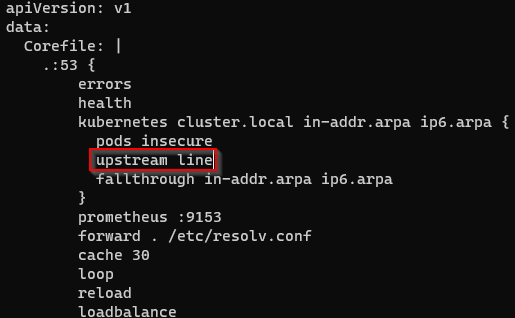
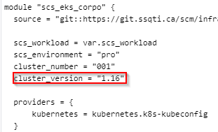
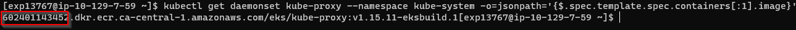
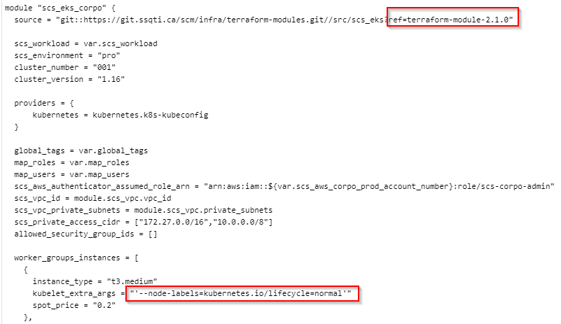

Opérations
**********

Telecharge le kube config pour la connexion sur le cluster eks
^^^^^^^^^^^^^^^^^^^^^^^^^^^^^^^^^^^^^^^^^^^^^^^^^^^^^^^^^^^^^^

Telecharge le fichier kube config (Cluster name structure: WORKLOAD: ti/.. PALIER: dev/pro => scs-aws-ti-dev-001)

    aws eks update-kubeconfig --name scs-aws-WORKLOAD-PALIER-001 --region ca-central-1

Surveillance du service cluster autoscaler
^^^^^^^^^^^^^^^^^^^^^^^^^^^^^^^^^^^^^^^^^^

Pour voir les logs du cluster autoscaler

    kubectl -n kube-system logs deployment.apps/cluster-autoscaler

Surveillance du service aws ingress controller
^^^^^^^^^^^^^^^^^^^^^^^^^^^^^^^^^^^^^^^^^^^^^^

Pour voir les logs du aws ingress controller

    kubectl -n kube-system logs deployment.apps/dev-alb-ingress-controller

Mise à jour d'un Cluster 1.15 à 1.16
^^^^^^^^^^^^^^^^^^^^^^^^^^^^^^^^^^^^

À partir du bastion

Enlever la ligne upstream line:

.. code-block:: bash

    kubectl edit configmap coredns -n kube-system

Ajouter la variable cluster_version à 1.16 dans le module scs_eks du worload visé

Déploiement du code (Terraform apply dans Jenkins deploy job (prend au moins 25 minutes))

Obtenir la version d'image kube-proxy (copier le numéro de compte comme indiqué plus bas) :

.. code-block:: bash

    kubectl get daemonset kube-proxy --namespace kube-system -o=jsonpath='{$.spec.template.spec.containers[:1].image}'

Mettre à jour l'image kube-proxy (Remplacer NO_COMPTE_AWS avec le numéro de compte copié plus haut)

.. code-block:: bash

   kubectl set image daemonset.apps/kube-proxy -n kube-system kube-proxy=NO_COMPTE_AWS.dkr.ecr.ca-central-1.amazonaws.com/eks/kube-proxy:v1.16.13-eksbuild.1

Vérifier la version de CoreDNS. Doit être >= 1.6.6

.. code-block:: bash

   kubectl describe deployment coredns --namespace kube-system | grep Image | cut -d "/" -f 3

Mettre à jour au besoin la version de CoreDNS à 1.6.6. Vérifier la version après :

.. code-block:: bash

   kubectl set image deployment.apps/coredns -n kube-system coredns:NO_COMPTE_AWS.dkr.ecr.ca-central-1.amazonaws.com/eks/coredns:v1.6.6-eksbuild.1

Vérifier la version du amazon-k8s-cni via:

.. code-block:: bash

   kubectl describe daemonset aws-node --namespace kube-system | grep Image | cut -d "/" -f 2

Mettre à jour au besoin la version du k8s-cni via:

.. code-block:: bash

   curl -o aws-k8s-cni.yaml https://raw.githubusercontent.com/aws/amazon-vpc-cni-k8s/v1.7.5/config/v1.7/aws-k8s-cni.yaml
   sed -i -e 's/us-west-2/ca-central-1/' aws-k8s-cni.yaml
   kubectl apply -f aws-k8s-cni.yaml

Vérifier et mettre à jour le cluster-autoscaler (voir https://github.com/kubernetes/autoscaler/releases pour la bonne version)
Remplacer WORKLOAD et PALIER dans la commande (Cluster name structure: WORKLOAD: ti/.. PALIER: dev/pro )

.. code-block:: bash

   kubectl -n kube-system set image deployment.apps/cluster-autoscaler scs-aws-WORKLOAD-PALIER-cluster-autoscaler=k8s.gcr.io/autoscaling/cluster-autoscaler:v1.16.6

Ajouter des guillemets simple aux arguments du paramêtre kubelet_extra_args dans les worker groups et ensuite passer la version du module à la version la plus récente 2.1.x

Déploiement du code (Terraform apply dans Jenkins deploy job)

.. warning:: N'utiliser que la version >= 2.1.0 du module scs_eks à partir de maintenant, il va changer l'ami des worker nodes.

Suivre la procédure des upgrades de worker nodes documentés
https://doc.scs.ssq.ca/scs-aws-s3-doc-dev-003/terraform-modules/develop/scs_eks/infrastructure/nodes.html#mise-a-jour-des-workers-nodes

Win!

Mise à jour d'un Cluster 1.16 à 1.17
^^^^^^^^^^^^^^^^^^^^^^^^^^^^^^^^^^^^

À partir du bastion du compte

Ajouter la variable cluster_version à 1.17 dans le module scs_eks du worload visé

Déploiement du code (Terraform apply dans Jenkins deploy job (prend au moins 25 minutes))

Obtenir la version d'image kube-proxy (copier le numéro de compte comme indiqué plus bas) :

.. code-block:: bash

    kubectl get daemonset kube-proxy --namespace kube-system -o=jsonpath='{$.spec.template.spec.containers[:1].image}'

Mettre à jour l'image kube-proxy (Remplacer NO_COMPTE_AWS avec le numéro de compte copié plus haut)

.. code-block:: bash

   kubectl set image daemonset.apps/kube-proxy -n kube-system kube-proxy=NO_COMPTE_AWS.dkr.ecr.ca-central-1.amazonaws.com/eks/kube-proxy:v1.17.9-eksbuild.1

Vérifier la version de CoreDNS. Doit être >= 1.6.6

.. code-block:: bash

   kubectl describe deployment coredns --namespace kube-system | grep Image | cut -d "/" -f 3

Mettre à jour au besoin la version de CoreDNS à 1.6.6. Vérifier la version après :

.. code-block:: bash

   kubectl set image deployment.apps/coredns -n kube-system coredns:NO_COMPTE_AWS.dkr.ecr.ca-central-1.amazonaws.com/eks/coredns:v1.6.6-eksbuild.1

Vérifier la version du amazon-k8s-cni via:

.. code-block:: bash

   kubectl describe daemonset aws-node --namespace kube-system | grep Image | cut -d "/" -f 2

Mettre à jour au besoin la version du k8s-cni via:

.. code-block:: bash

   curl -o aws-k8s-cni.yaml https://raw.githubusercontent.com/aws/amazon-vpc-cni-k8s/v1.7.5/config/v1.7/aws-k8s-cni.yaml
   sed -i -e 's/us-west-2/ca-central-1/' aws-k8s-cni.yaml
   kubectl apply -f aws-k8s-cni.yaml

Vérifier et mettre à jour le cluster-autoscaler (voir https://github.com/kubernetes/autoscaler/releases pour la bonne version)
Remplacer WORKLOAD et PALIER dans la commande (Cluster name structure: WORKLOAD: ti/.. PALIER: dev/pro )

.. code-block:: bash

   kubectl -n kube-system set image deployment.apps/cluster-autoscaler scs-aws-WORKLOAD-PALIER-cluster-autoscaler=k8s.gcr.io/autoscaling/cluster-autoscaler:v1.17.4

Déploiement du code (Terraform apply dans Jenkins deploy job)

.. warning:: N'utiliser que la version >= 3.1.0 du module scs_eks à partir de maintenant, il va changer l'ami des worker nodes.

Suivre la procédure des upgrades de worker nodes documentés
https://doc.scs.ssq.ca/scs-aws-s3-doc-dev-003/terraform-modules/develop/scs_eks/infrastructure/nodes.html#mise-a-jour-des-workers-nodes

Win!