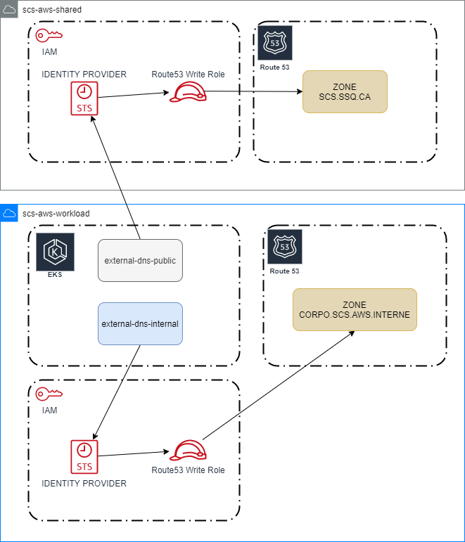

Détail d'utilisation
====================

Afin que les déploiement en production puissent créer leur propre entrées DNS dans les zones de Route53
dans le compte de shared. Un identity provider est créé dans celui ci pour chaque appel du module
qui authorise le cluster kubernetes du compte appeleur a faire des authentifications sts. Par la suite,
le déploiement de external dns peut alors creer des entrées en assumant un role qui à les droits IAM requis.

Le principe de consommation par le biais d'annotation est décris sur le site d'`external-dns`_ et
les `projets référence`_.

.. _external-dns: https://github.com/kubernetes-sigs/external-dns
.. _projets référence: https://git.ssqti.ca/projects/PR