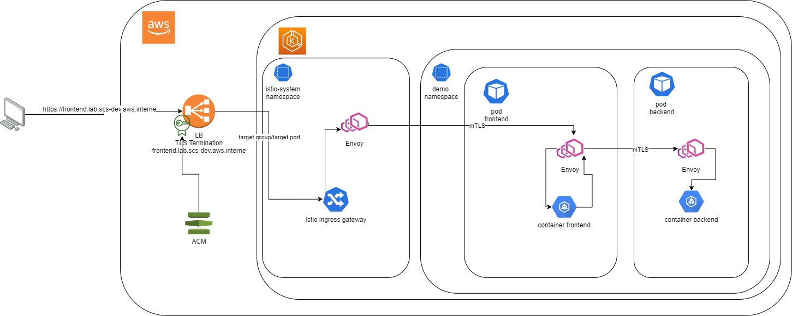

Détail complet d'utilisation
============================

Ce module installe `istio`_ dans le cluster kubernetes, il n'active pas istio sur un namespace.

Ce module crée les ressources suivantes :
  - namespace pour héberger istio (par défaut : istio-system)
  - installation du helm chart istio-base en version 1.1.1
  - installation du helm chart istio-discovery en version 1.2.0
  - La création d'un role avec une policy permettant le provisionning de network Loab Balancer (utilisé par le scs_istio_ingress)
    Pour plus d'information sur les permissions, voir la doc  `istio aws NLB <https://istio.io/latest/blog/2018/aws-nlb/>`_

.. _istio: https://istio.io/

Chiffrement TLS
---------------

Pour les services déployé dans le mesh Istio, il y a actuellement les chiffrement TLS suivants :
 - Du navigateur client au Network Load Balancer. Pour ce chiffrement ce sont les certificats attachés au Load Balancer qui sont utilisés (en fonction du domaine appelé)
 - Toute communication à l'intérieur du mesh est chiffrée en Mutual TLS. Pour ces chiffrements, ce sont des certificats interne à istio qui sont utilisés

Le schéma ci dessous décrit les communications

